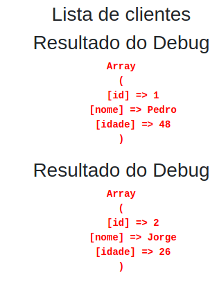

# Função para debugar código PHP

Debugar, corrigir error é uma tarefa muito importante para programadores. Então se cada um procurar se carcar de boas ferramentas de trabalho poderá reduzir o tempo da caça ao bug.

Debuga variáveis, arrays e objetos, tanto em código procedural quanto em OO

Já tentou debugar uma variável PHP que está dentro de uma tabela HTML? Bem, não dá certo da mesma forma que fora.

Uma vantagem desta pequena função é que ela debuga inclusive dentro de tabelas HTML. Basta passar o parâmetro $t = 1. Veja abaixo exmeplos.

```php
<?php
function d( $params = [], $die = true)
{
    print '<style>.pre_red{font-size: 14px;color:red;}.pre_black{font-size: 14px;}</style>';
    print '<h3>Resultado do Debug</h3>';

    if(!empty($params)){
        echo '<b><pre class="pre_red">';
        print_r($params);
        echo '</pre></b>';
    }
    if ($die) die();
}
```
## Sintaxe

Sintaxe: d( $params = [], $die = true, $t=0)

### Para debugar dentro de tabela HTML use $t = 1

d($var, 1);

### Para debugar somente uma variável fora de tabela HTML

d($var);

### Para debugar 3 variáveis fora de tabela HTML
```php
d($var,false); // $die = false
d($var2,false); // $die = false
d($var3); // $die = true
```
Na primeira e na segunda use "false", na última, não.

## Outro exemplo:

Crie o arquivo teste.php contendo:

```php
<table><tr><td>
<?php $arr = array(0 => 'a', 1 =>'b');?>
</td></tr></table>

<?php
require_once 'd.php';

d($arr);
```
## Adicionar ao include_path do PHP

Assim esta função ficará disponível em qualquer aplicativo.

Aqui salvei como "d.php" no include_path, que no meu caso é em /usr/share/php.

Podemos adicionar ao include_path outro diretório assim, adicionei ':/usr/share/php':include_path = ".:/php/includes:/usr/share/php"

Isso acima é feito no php.ini.

Mini Framework MVC com PHP #01 - Criando a estrutura do projeto - https://www.youtube.com/watch?v=A1rVfAZ4hk8

Eu criei a função d() tendo como referência a função dd() do Bruno Correia citada no vídeo acima.

## Exemplo dentro de um laço, usando o false

```php
require 'd.php';
foreach ($clients as $client) {

d($client,false);
```


## Agora o mesmo exemplo mas não usando false

Então ele para ao processar a primeira vez.
E encerra o processamento do script.


## Sugestão

Para que não precise ficar digitando o require, precisamos usá-lo num arquivo que foi incluído no aplicativo, logo no início.

Um bom lugar é inserir no início do config.php:

define('ENVIRONMENT', 'dev'); // Or 'prod'

if (ENVIRONMENT == 'dev') {
    error_reporting(E_ALL);
    ini_set("display_errors", 1);
    require_once 'd.php';
}

Pronto. Daqui pra frente basta inserir a função

d($var); // Para encerrar após processar

ou

d($var, false); // Para poder processar mais variáveis antes de sair
d($var2); // Processar e sair

## Laravel

No laravel podemos inserir logo no início do config/app.php

<?php

require_once 'd.php';

Agora, em qualquer arquivo podemos usar apenas:

d($var);

## Economizando toques

Ao invés de digitar

print 'AQUI';exit;

Podemos digitar apenas

d('AQUI');

Ainda ganhamos o destaque do vermelho.
